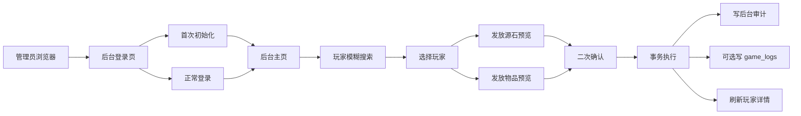
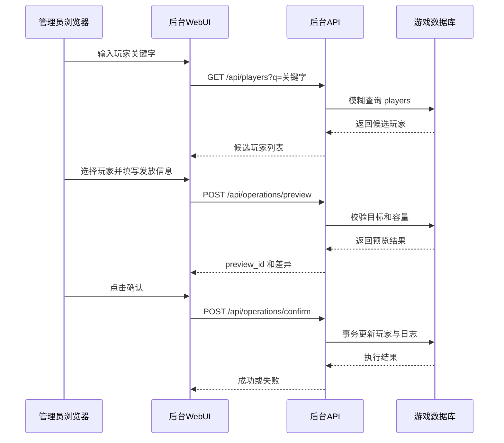

# 后台设计方案

## 一、概述

本方案面向 `xiuxianserver` 里的修仙业务，目标是在现有 FastAPI 服务内新增一个真正可用的 **WebUI 后台**，用于管理员对玩家进行查询和运营操作。

后台的核心能力包括：

- 按玩家名做模糊搜索，快速定位目标玩家。
- 给指定玩家发放源石，并记录审计日志。
- 给指定玩家发放指定物品和数量，并记录审计日志。
- 支持首次初始化管理员账号，后续通过账号密码登录。
- 对所有写操作做二次确认、事务提交和审计留痕。

当前后台接口组件仍处于空路由状态，说明文件也明确了它只承接 HTTP API，不挂载 WS 玩家命令：

- [`后台接口/说明.md`](../xiuxian3/xiuxianserver/修仙/后台接口/说明.md)
- [`修仙/__init__.py`](../xiuxian3/xiuxianserver/修仙/__init__.py)
- [`launch/load_router.py`](../xiuxian3/xiuxianserver/launch/load_router.py)

因此，本方案不会新开前端工程，而是直接在同一套服务里补齐后台页面和后台 API。

## 二、设计目标

### 2.1 目标

1. 提供一个可访问的后台 WebUI。
2. 让管理员能够快速检索玩家。
3. 支持向玩家发放源石。
4. 支持向玩家发放背包物品或纳戒物品。
5. 所有写操作都必须可追溯、可审计、可复查。
6. 后台与玩家 WS 玩法解耦，不影响原有命令体系。

### 2.2 边界

- 后台只负责管理和观测，不替代玩家正式入口。
- 后台只走 HTTP，不增加 WS 命令。
- 后台写入必须走事务，不允许半成功。
- 后台不直接改造战斗、宗门战、探险等主玩法结算规则。

## 三、现有基础与可复用能力

### 3.1 路由挂载方式

修仙总包会自动把二级组件的 `router` 挂载到 HTTP 路由里，这意味着只要后台接口组件继续暴露 router，就可以直接被服务加载：

- [`修仙/__init__.py`](../xiuxian3/xiuxianserver/修仙/__init__.py)
- [`main.py`](../xiuxian3/xiuxianserver/main.py)
- [`launch/load_router.py`](../xiuxian3/xiuxianserver/launch/load_router.py)

### 3.2 现有可复用能力

现有代码已经提供了一批非常适合后台复用的基础能力：

- 玩家精确读取：[`player_by_ref()`](../xiuxian3/xiuxianserver/修仙/common.py:491)
- 玩家展示名读取：[`format_player_name()`](../xiuxian3/xiuxianserver/修仙/common.py:2768)
- 背包物品定义：[`item_def_by_name()`](../xiuxian3/xiuxianserver/修仙/common.py:2369)
- 纳戒物品定义：[`ring_item_def_by_name()`](../xiuxian3/xiuxianserver/修仙/common.py:2379)
- 背包增量写入：[`add_backpack_conn()`](../xiuxian3/xiuxianserver/修仙/common.py:2447)
- 纳戒增量写入：[`add_ring_conn()`](../xiuxian3/xiuxianserver/修仙/common.py:2547)
- 背包容量预检：[`can_add_backpack_conn()`](../xiuxian3/xiuxianserver/修仙/common.py:2462)
- 事务上下文：[`transaction()`](../xiuxian3/xiuxianserver/修仙/sql.py:776)
- 玩家表：[`players`](../xiuxian3/xiuxianserver/修仙/sql.py:858)
- 源库表：[`source_vaults`](../xiuxian3/xiuxianserver/修仙/sql.py:891)
- 通用日志表：[`game_logs`](../xiuxian3/xiuxianserver/修仙/sql.py:1584)

### 3.3 需要补齐的能力

后台要真正落地，还需要补齐下面几类能力：

- 管理员账号体系。
- 登录会话体系。
- 玩家模糊搜索。
- 后台操作审计表。
- 源石发放的事务内写入能力。
- 发放物品的统一确认流程。

## 四、后台 WebUI 设计

### 4.1 页面入口

建议后台 WebUI 直接挂在同一服务下，保持简洁：

- `/xiuxian/admin`：后台首页。
- `/xiuxian/admin/login`：登录页。
- `/xiuxian/admin/bootstrap`：首次初始化页。
- `/xiuxian/admin/operations`：后台操作列表页。

如果管理员未登录，访问 `/xiuxian/admin` 自动跳转到登录页。
如果系统里还没有管理员，访问 `/xiuxian/admin/login` 自动展示初始化流程。

### 4.2 页面布局

建议采用两栏或三栏布局，延续帮助站的纯 HTML + 少量 JS 风格，避免额外前端依赖。

#### 登录页

- 管理员账号输入。
- 管理员密码输入。
- 若尚未创建管理员，则显示初始化表单。
- 初始化表单额外需要一次性密钥 `ADMIN_BOOTSTRAP_TOKEN`。

#### 后台首页

推荐拆成四个区域：

1. **顶部状态栏**
   - 当前管理员名称。
   - 退出按钮。
   - 当前登录状态。

2. **左侧玩家检索区**
   - 模糊搜索框。
   - 搜索结果列表。
   - 每条结果展示：昵称、等级、状态、地点、随身源石。

3. **中间玩家详情区**
   - 玩家基础信息。
   - 当前源石与源库信息。
   - 背包和纳戒摘要。
   - 最近操作记录。

4. **右侧操作面板**
   - 发放源石。
   - 发放物品。
   - 预览区。
   - 二次确认按钮。

### 4.3 交互流程



### 4.4 页面上的关键规则

- 搜索结果必须允许快速点选，减少手动输入错误。
- 物品选择必须显示来源类型，避免背包物品和纳戒物品重名造成误发。
- 发放源石和发放物品都必须先预览，再确认执行。
- 预览页必须明确显示：目标玩家、发放内容、前后差值、风险提示。
- 执行后立即刷新玩家详情和后台审计列表。

## 五、数据流设计

### 5.1 典型流程



### 5.2 发放源石流程

1. 搜索并选定玩家。
2. 填写源石数量。
3. 预览阶段读取玩家当前源石。
4. 确认后在事务里更新 `players.source_stones`。
5. 写入后台审计表。
6. 可选同步写入 `game_logs`，供玩家侧查看。

### 5.3 发放物品流程

1. 搜索并选定玩家。
2. 搜索并选定物品。
3. 明确物品来源：背包物品或纳戒物品。
4. 预览阶段校验数量、堆叠上限、背包负重。
5. 确认后在事务里写入对应库存表。
6. 写入后台审计表。
7. 可选同步写入 `game_logs`。

## 六、后端 API 设计

### 6.1 页面类路由

| 方法 | 路径 | 作用 |
|---|---|---|
| GET | `/xiuxian/admin` | 后台首页 |
| GET | `/xiuxian/admin/login` | 登录页 |
| GET | `/xiuxian/admin/bootstrap` | 首次初始化页 |
| GET | `/xiuxian/admin/operations` | 后台操作列表页 |

### 6.2 鉴权类 API

| 方法 | 路径 | 作用 |
|---|---|---|
| GET | `/xiuxian/admin/api/bootstrap-status` | 判断是否已存在管理员 |
| POST | `/xiuxian/admin/api/bootstrap` | 首次创建管理员 |
| POST | `/xiuxian/admin/api/login` | 管理员登录 |
| POST | `/xiuxian/admin/api/logout` | 退出登录 |
| GET | `/xiuxian/admin/api/me` | 读取当前登录态 |

### 6.3 查询类 API

| 方法 | 路径 | 作用 |
|---|---|---|
| GET | `/xiuxian/admin/api/players` | 玩家模糊搜索 |
| GET | `/xiuxian/admin/api/players/{client_id}` | 玩家详情 |
| GET | `/xiuxian/admin/api/items` | 物品模糊搜索 |
| GET | `/xiuxian/admin/api/operations` | 后台操作列表 |
| GET | `/xiuxian/admin/api/operations/{operation_id}` | 后台操作详情 |

### 6.4 写入类 API

| 方法 | 路径 | 作用 |
|---|---|---|
| POST | `/xiuxian/admin/api/operations/preview` | 生成发放预览 |
| POST | `/xiuxian/admin/api/operations/confirm` | 确认执行发放 |

### 6.5 搜索规则

#### 玩家搜索

建议支持：

- `client_id` 精确匹配。
- `display_name` 前缀匹配。
- `display_name` 包含匹配。

返回结果建议包含：

- `client_id`
- `display_name`
- `level`
- `source_stones`
- `status`
- `location_name`
- `x`、`y`

#### 物品搜索

建议同时查询：

- 背包物品定义：[`item_defs`](../xiuxian3/xiuxianserver/修仙/sql.py:939)
- 纳戒物品定义：[`ring_item_defs`](../xiuxian3/xiuxianserver/修仙/sql.py:953)

返回结果建议包含：

- `scope`，取值 `backpack` 或 `ring`
- `item_id`
- `name`
- `category`
- `quality`
- `usable`
- `stack_limit`，背包物品才需要
- `target_type`，纳戒物品才需要

### 6.6 预览与确认接口

#### 预览接口

`POST /xiuxian/admin/api/operations/preview`

建议请求体：

```json
{
  "request_id": "uuid",
  "action_type": "grant_stones",
  "target_client_id": "abc123",
  "stones_amount": 10000,
  "reason": "活动补发",
  "note": "补偿",
  "item_scope": "",
  "item_id": "",
  "quantity": 0
}
```

若是物品发放，则请求体类似：

```json
{
  "request_id": "uuid",
  "action_type": "grant_item",
  "target_client_id": "abc123",
  "item_scope": "ring",
  "item_id": "xueqidan",
  "quantity": 5,
  "reason": "活动奖励",
  "note": "补给"
}
```

建议返回：

```json
{
  "preview_id": 1024,
  "status": "pending",
  "warnings": [],
  "before": {
    "source_stones": 12000
  },
  "after": {
    "source_stones": 22000
  },
  "expires_at": "2026-06-23T12:00:00+08:00"
}
```

#### 确认接口

`POST /xiuxian/admin/api/operations/confirm`

建议只提交：

- `preview_id`
- `request_id`

确认时服务器必须重新读取预览记录，检查目标和参数是否一致，再执行真正写入。

## 七、数据库设计

### 7.1 管理员表 `admin_users`

用于保存管理员账号信息。

```sql
CREATE TABLE IF NOT EXISTS admin_users (
    admin_id INTEGER PRIMARY KEY AUTOINCREMENT,
    username TEXT NOT NULL UNIQUE,
    password_hash TEXT NOT NULL,
    password_salt TEXT NOT NULL,
    role TEXT NOT NULL DEFAULT 'super_admin',
    is_active INTEGER NOT NULL DEFAULT 1,
    failed_login_count INTEGER NOT NULL DEFAULT 0,
    locked_until TEXT,
    last_login_at TEXT,
    created_at TEXT NOT NULL,
    updated_at TEXT NOT NULL
);
```

#### 说明

- `password_hash` 不存明文。
- 密码建议使用标准库 `hashlib.pbkdf2_hmac()` 做哈希。
- `role` 预留角色扩展能力，初版默认 `super_admin`。
- `failed_login_count` 和 `locked_until` 用于简单防爆破。

### 7.2 会话表 `admin_sessions`

用于保存登录态。

```sql
CREATE TABLE IF NOT EXISTS admin_sessions (
    session_id INTEGER PRIMARY KEY AUTOINCREMENT,
    admin_id INTEGER NOT NULL,
    session_token_hash TEXT NOT NULL UNIQUE,
    expires_at TEXT NOT NULL,
    last_seen_at TEXT NOT NULL,
    revoked_at TEXT,
    ip TEXT NOT NULL DEFAULT '',
    user_agent TEXT NOT NULL DEFAULT '',
    created_at TEXT NOT NULL
);
```

#### 说明

- 浏览器 cookie 里存原始 token。
- 数据库里只存 token 哈希。
- 登出时只把会话作废，不删除记录，便于审计。

### 7.3 后台操作表 `admin_operations`

用于记录预览、确认、成功、失败等全过程。

```sql
CREATE TABLE IF NOT EXISTS admin_operations (
    operation_id INTEGER PRIMARY KEY AUTOINCREMENT,
    request_id TEXT NOT NULL UNIQUE,
    admin_id INTEGER NOT NULL,
    action_type TEXT NOT NULL,
    target_client_id TEXT NOT NULL,
    target_name_snapshot TEXT NOT NULL DEFAULT '',
    item_scope TEXT NOT NULL DEFAULT '',
    item_id_snapshot TEXT NOT NULL DEFAULT '',
    item_name_snapshot TEXT NOT NULL DEFAULT '',
    stones_amount INTEGER NOT NULL DEFAULT 0,
    quantity INTEGER NOT NULL DEFAULT 0,
    reason TEXT NOT NULL DEFAULT '',
    note TEXT NOT NULL DEFAULT '',
    before_json TEXT NOT NULL DEFAULT '{}',
    after_json TEXT NOT NULL DEFAULT '{}',
    warnings_json TEXT NOT NULL DEFAULT '[]',
    rollback_json TEXT NOT NULL DEFAULT '{}',
    status TEXT NOT NULL,
    error_message TEXT NOT NULL DEFAULT '',
    operator_ip TEXT NOT NULL DEFAULT '',
    user_agent TEXT NOT NULL DEFAULT '',
    created_at TEXT NOT NULL,
    confirmed_at TEXT,
    executed_at TEXT,
    updated_at TEXT NOT NULL
);
```

#### 状态建议

- `pending`：已预览，等待确认。
- `running`：已进入执行事务。
- `success`：执行成功。
- `failed`：执行失败。
- `expired`：超时未确认。
- `canceled`：管理员主动取消。

#### 说明

- `before_json` 保存执行前快照。
- `after_json` 保存预期或实际后快照。
- `rollback_json` 保存回滚材料，便于将来扩展手动回滚。
- `request_id` 用于幂等，避免重复点击造成重复发放。

### 7.4 元信息表 `admin_meta`

用于存储后台全局状态。

```sql
CREATE TABLE IF NOT EXISTS admin_meta (
    key TEXT PRIMARY KEY,
    value TEXT NOT NULL
);
```

建议至少保存：

- `bootstrap_locked`
- `bootstrap_admin_id`
- `bootstrap_created_at`
- `schema_version`

### 7.5 与现有表的关联

| 后台能力 | 读表 | 写表 |
|---|---|---|
| 管理员初始化 | `admin_meta` | `admin_users`、`admin_meta`、`admin_sessions` |
| 管理员登录 | `admin_users`、`admin_sessions` | `admin_users`、`admin_sessions` |
| 玩家搜索 | `players` | 无 |
| 物品搜索 | `item_defs`、`ring_item_defs` | 无 |
| 发放源石 | `players` | `players`、`admin_operations`、`game_logs` |
| 发放物品 | `players`、`item_defs`、`ring_item_defs`、`backpack_items`、`ring_items`、`gem_items` | `backpack_items` 或 `ring_items` 或 `gem_items`、`admin_operations`、`game_logs` |

## 八、写入逻辑设计

### 8.1 发放源石

建议后台单独提供事务内的源石增加逻辑。

处理步骤：

1. 校验目标玩家存在。
2. 校验数量大于 0。
3. 读取发放前源石。
4. 事务内更新 `players.source_stones`。
5. 写后台审计。
6. 可选写 `game_logs`，记录为 `后台发放源石`。

### 8.2 发放物品

处理步骤：

1. 校验目标玩家存在。
2. 校验物品来源和物品 ID。
3. 校验数量大于 0。
4. 若是背包物品，先走容量预检：[`can_add_backpack_conn()`](../xiuxian3/xiuxianserver/修仙/common.py:2462)。
5. 若是背包物品，事务内调用 [`add_backpack_conn()`](../xiuxian3/xiuxianserver/修仙/common.py:2447)。
6. 若是纳戒物品，事务内调用 [`add_ring_conn()`](../xiuxian3/xiuxianserver/修仙/common.py:2547)。
7. 写后台审计。
8. 可选写 `game_logs`，记录为 `后台发放物品`。

### 8.3 事务边界

所有发放操作都必须放在 [`transaction()`](../xiuxian3/xiuxianserver/修仙/sql.py:776) 中执行，保证：

- 预览结果和实际写入尽量一致。
- 成功时一次提交。
- 失败时自动回滚。
- 审计日志与实际结果同步。

## 九、安全与权限设计

### 9.1 首次初始化保护

后台首次创建管理员必须满足两个条件：

- 数据库里还没有管理员账号。
- 请求携带 `.env` 配置的 `ADMIN_BOOTSTRAP_TOKEN`。

建议新增 `.env` 自定义键：

```text
ADMIN_BOOTSTRAP_TOKEN=请填一次性初始化密钥
ADMIN_SESSION_TTL_DAYS=7
ADMIN_COOKIE_NAME=xiuxian_admin_session
```

初始化完成后，首次密钥即失效。

### 9.2 登录安全

- 密码只存哈希，不存明文。
- 登录成功后发放会话 cookie。
- cookie 建议设置 `HttpOnly`、`SameSite=Lax`。
- 若部署在 HTTPS，建议开启 `Secure`。
- 失败登录建议递增计数，达到阈值后临时锁定。

### 9.3 请求安全

- 所有写操作使用 `POST`。
- 所有写操作都要求 `request_id`。
- 所有写操作都必须先预览再确认。
- 关键提交页应带 CSRF 防护。
- 搜索接口只读，但也要鉴权，避免公开暴露玩家信息。

### 9.4 权限模型

初版只保留单角色：`super_admin`。

后续如果要扩展权限，可进一步拆成：

- `viewer`：只读。
- `operator`：可发放。
- `super_admin`：可初始化、授权、发放、审计。

## 十、审计与追踪设计

后台不能只看“最终成功”，必须保留完整过程。

建议审计至少记录：

- 操作人。
- 操作时间。
- 操作类型。
- 目标玩家。
- 物品或源石数量。
- 操作原因。
- 预览前状态。
- 预览后状态。
- 执行结果。
- 失败原因。
- IP 和 User-Agent。

如果后台发放希望被玩家端感知，可以再同步往 [`game_logs`](../xiuxian3/xiuxianserver/修仙/sql.py:1584) 里写一条记录，但后台审计表仍应作为主记录。

## 十一、建议的模块文件

为了保持和现有玩法组件一致，建议后台组件拆成下面几个文件：

- [`修仙/后台接口/__init__.py`](../xiuxian3/xiuxianserver/修仙/后台接口/__init__.py)
- [`修仙/后台接口/site.py`](../xiuxian3/xiuxianserver/修仙/后台接口/site.py)
- [`修仙/后台接口/service.py`](../xiuxian3/xiuxianserver/修仙/后台接口/service.py)
- [`修仙/后台接口/schema.py`](../xiuxian3/xiuxianserver/修仙/后台接口/schema.py)

### 分工建议

- `__init__.py`：暴露 router，挂载页面和 API。
- `site.py`：负责 HTML 页面渲染。
- `service.py`：负责登录、搜索、预览、发放、审计。
- `schema.py`：负责请求和响应数据模型。

## 十二、实施顺序

建议按以下顺序落地：

1. 新增管理员相关数据表和元信息表。
2. 实现后台登录、初始化、退出和当前登录态。
3. 实现玩家模糊搜索和物品模糊搜索。
4. 实现源石发放的预览与确认。
5. 实现物品发放的预览与确认。
6. 实现后台操作审计列表与详情页。
7. 完成后台 WebUI 页面和交互细节。
8. 补充测试，覆盖登录、搜索、发放、回滚和重复提交。

## 十三、建议的验收标准

当后台完成后，至少应满足下面几个验收点：

- 可以首次创建管理员账号。
- 可以正常登录和退出。
- 可以通过模糊搜索找到玩家。
- 可以给指定玩家发放源石。
- 可以给指定玩家发放物品。
- 每次发放都能查到审计记录。
- 重复点击不会造成重复发放。
- 容量不足或参数错误时会明确提示，不会污染数据库。

## 十四、总结

这套后台方案遵循当前项目的既有风格：

- 继续使用 FastAPI 原生路由。
- 继续使用数据库作为唯一事实来源。
- 继续使用事务保证结算一致性。
- 继续使用轻量 HTML 页面，避免额外前端工程。

它能满足“给 A 玩家发放 B 数量的 C 物品”以及“给 A 玩家发放 B 数量源石”这两类最核心的后台需求，同时把鉴权、审计和安全边界一起补齐。