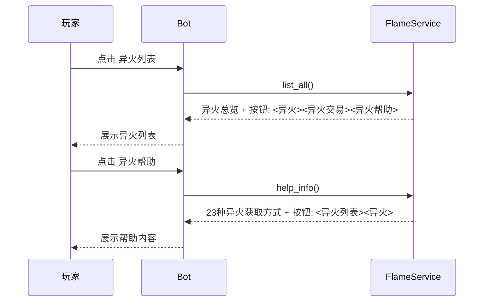

# 异火帮助按钮实施方案

## 需求

在"异火列表"按钮的回复消息底部，现有按钮 `<异火><异火交易>` 右侧新增 `<异火帮助>` 按钮。点击后展示23种异火的获取方式。

## 当前现状

- `list_all()` 方法（service.py 第84行）底部按钮：`T.buttons("异火", "异火交易")`
- 23种异火按 `source_type` 分为3类：
  - `fusion`：帝炎（rank 1）—— 集齐22种异火合成
  - `boss_wormhole`：虚无吞炎 ~ 幽冥毒火（rank 2~20）—— 首领奖励 / 虫洞奖励
  - `explore_low`：阴阳双炎、万兽灵火、玄黄炎（rank 21~23）—— 探险结算 / 首领奖励 / 虫洞奖励

## 改动点（共2个文件，3处改动）

### 1. `service.py` — `list_all()` 底部按钮追加"异火帮助"

**文件**: `xiuxian3/xiuxianserver/修仙/异火/service.py`
**位置**: 第84行

```python
# 改前
return panel.render() + T.buttons("异火", "异火交易")

# 改后
return panel.render() + T.buttons("异火", "异火交易", "异火帮助")
```

### 2. `service.py` — FlameService 新增 `help_info()` 方法

**文件**: `xiuxian3/xiuxianserver/修仙/异火/service.py`
**位置**: `trade_info()` 方法之后，`try_grant_flame()` 方法之前

新增一个 `@staticmethod` 方法 `help_info()`，从数据库 `flame_defs` 表读取23种异火，按 `source_type` 分组展示获取方式：

```python
@staticmethod
def help_info(client_id: str) -> str:
    """展示23种异火的获取方式。"""

    rows = db.fetch_all("SELECT rank, name, source_type FROM flame_defs ORDER BY rank")

    source_map = {
        "fusion": "合成",
        "boss_wormhole": "首领/虫洞",
        "explore_low": "探险/首领/虫洞",
    }

    panel = T.panel()
    panel.section("异火获取帮助")

    panel.section("合成获取")
    panel.line("帝炎（第1名）：集齐第2~23名共22种异火后，使用「异火合成」获得。")

    panel.section("首领/虫洞获取")
    for row in rows:
        if row["source_type"] == "boss_wormhole":
            panel.line(f"第{row['rank']}名 **{row['name']}**")

    panel.section("探险/首领/虫洞获取")
    for row in rows:
        if row["source_type"] == "explore_low":
            panel.line(f"第{row['rank']}名 **{row['name']}**")

    panel.hr()
    panel.line("提示：探险结算有概率获得 rank 21~23 异火；首领和虫洞奖励有概率获得 rank 2~23 异火。")

    return panel.render() + T.buttons("异火列表", "异火")
```

### 3. `__init__.py` — 新增 `异火帮助` 命令处理器

**文件**: `xiuxian3/xiuxianserver/修仙/异火/__init__.py`
**位置**: 在 `ws_flame_trade` 函数之后新增

```python
@WsMessageHandler.handler(cmd="异火帮助", priority=100, block=True)
async def ws_flame_help(client_id: str, message: str) -> None:
    """展示23种异火的获取方式。"""

    await send_reply(client_id, service.help_info(client_id), ws_manager, service)
```

## 交互流程



## help_info 输出示例

```
> **异火获取帮助**
>
> **合成获取**
> 帝炎（第1名）：集齐第2~23名共22种异火后，使用「异火合成」获得。
>
> **首领/虫洞获取**
> 第2名 **虚无吞炎**
> 第3名 **净莲妖火**
> ...（共19种）
> 第20名 **幽冥毒火**
>
> **探险/首领/虫洞获取**
> 第21名 **阴阳双炎**
> 第22名 **万兽灵火**
> 第23名 **玄黄炎**
>
> 提示：探险结算有概率获得 rank 21~23 异火；首领和虫洞奖励有概率获得 rank 2~23 异火。

<异火列表><异火>
```

## 不改动的部分

- 不修改数据库表结构
- 不修改其他方法的按钮
- 不修改 `try_grant_flame` 等业务逻辑
