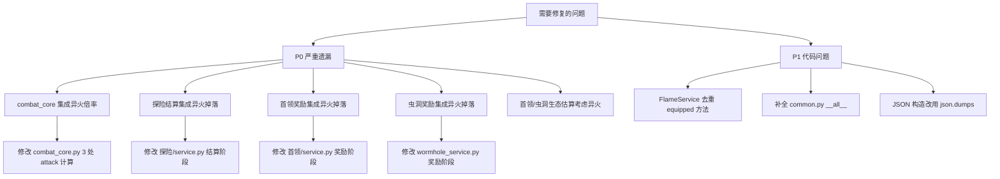

# 异火模块代码审查报告

审查时间：2026-06-22
对照文档：`plans/异火模块设计方案.md`

---

## 一、已完成并正确的部分 ✅

### 1.1 异火核心组件 `xiuxian3/xiuxianserver/修仙/异火/`

| 文件 | 状态 | 说明 |
|------|------|------|
| `__init__.py` | ✅ 正确 | 7 个 WS 命令全部注册：异火、异火列表、异火详情、异火装备、异火卸下、异火合成、异火交易 |
| `service.py` | ✅ 正确 | FlameService 继承 CoreService，实现查询/装备/卸下/合成/交易说明/发放/补偿/倍率 |
| `说明.md` | ✅ 正确 | 文档与设计方案一致 |

### 1.2 数据库层 `sql.py`

| 项目 | 状态 | 说明 |
|------|------|------|
| `flame_defs` 建表 | ✅ | 字段与设计方案表结构完全一致 |
| `player_flames` 建表 | ✅ | `(client_id, flame_id)` 复合主键，字段正确 |
| `flame_fusion_records` 建表 | ✅ | record_id 自增主键，字段正确 |
| `FLAME_DEFS` 数据播种 | ✅ | 23 种异火全部定义，rank 1~23，倍率递减，source_type 正确 |
| `INSERT OR REPLACE` 播种 | ✅ | market_sellable 固定为 0，created_at 固定为空字符串 |

### 1.3 公共方法 `common.py`

| 方法 | 状态 | 说明 |
|------|------|------|
| `equipped_flame_multiplier()` | ✅ | 默认 1.0，JOIN 查询正确 |
| `equipped_flame_name()` | ✅ | 未装备返回空字符串 |
| `final_attack()` | ✅ | `floor((base + weapon) * multiplier)`，已在 `__all__` 中导出 |

### 1.4 玩家面板 `玩家/service.py`

| 项目 | 状态 | 说明 |
|------|------|------|
| 修仙信息面板异火显示 | ✅ | 第 77~84 行：装备时显示异火名 x 倍率和最终攻击，未装备显示"异火：未装备" |

### 1.5 二手市场 `二手市场/service.py`

| 项目 | 状态 | 说明 |
|------|------|------|
| `_try_sell_flame()` 异火上架 | ✅ | 检查异火名称匹配 → 价格校验 → 已装备拒绝 → 从 player_flames 删除 → 写入 listings |
| `_restore_flame_cancel()` 下架退回 | ✅ | INSERT 回 player_flames，source = "二手市场下架" |
| `_restore_flame_buy()` 购买发放 | ✅ | 检查买家是否已有帝炎/同名 → INSERT player_flames，source = "二手市场购买" |
| `item_type = "flame"` 展示 | ✅ | 查询 flame_defs 获取名称 |
| 下架/购买流程集成 | ✅ | 在 cancel 和 buy 两条路径都正确处理了 flame 类型 |

---

## 二、严重遗漏 ❌（必须修复）

### 2.1 战斗核心未集成异火攻击倍率 ❌

**文件**：[`combat_core.py`](xiuxian3/xiuxianserver/修仙/combat_core.py)

**问题**：[`_player_combat_state()`](xiuxian3/xiuxianserver/修仙/combat_core.py:502) 第 521 行直接使用 `int(player["base_attack"]) + self.weapon_attack(weapon)` 计算攻击力，**没有乘以异火倍率**。

```python
# 第 521 行 - 当前代码（缺少异火倍率）
"attack": int(player["base_attack"]) + self.weapon_attack(weapon),
```

**设计方案要求**（第七章）：
> "修仙信息、状态、战斗核心、首领/虫洞生态估算都调用统一最终攻击方法"
> "计算最终攻击：整数化后攻击 = floor((base_attack + weapon_attack) * flame_multiplier)"

**影响范围**：
- [`_player_combat_state()`](xiuxian3/xiuxianserver/修仙/combat_core.py:502) 第 521 行 - 玩家打怪/对战
- [`_snapshot_player_combat_state()`](xiuxian3/xiuxianserver/修仙/combat_core.py:435) 第 457 行 - 探险快照还原
- [`_secret_realm_actor_state()`](xiuxian3/xiuxianserver/修仙/combat_core.py:489) 第 490 行 - 太虚映身

**修复建议**：
```python
# 应改为
flame_mult = self.equipped_flame_multiplier(client_id)
"attack": max(1, math.floor((int(player["base_attack"]) + self.weapon_attack(weapon)) * flame_mult)),
```

### 2.2 探险未集成异火掉落 ❌

**文件**：[`探险/service.py`](xiuxian3/xiuxianserver/修仙/探险/service.py)

**问题**：整个文件中没有任何 `flame`、`异火`、`roll_explore_flame` 相关代码。异火服务中 [`roll_explore_flame()`](xiuxian3/xiuxianserver/修仙/异火/service.py:427) 方法已写好，但从未被探险结算调用。

**设计方案要求**（第四章/第五章）：
> "任意普通区域探险均可触发 rank 21~23 异火产出"
> "建议只在探险结算阶段增加一次极低概率判定"

**修复建议**：
在探险结算（怪物战斗结束后的奖励发放阶段）中，调用 `service.roll_explore_flame(conn, client_id)`，如果返回 `granted = True` 则追加异火获得文本，如果返回 `compensation` 则抽取低一档补偿并追加补偿文案。

### 2.3 首领未集成异火掉落 ❌

**文件**：[`首领/service.py`](xiuxian3/xiuxianserver/修仙/首领/service.py)

**问题**：整个文件中没有任何 `flame`、`异火`、`roll_boss_wormhole_flame` 相关代码。

**设计方案要求**（第四章/第五章）：
> "rank 2 至 rank 23 异火可在首领奖励或虫洞奖励里掉落"
> "异火奖励是最珍贵战利品；掉落权重从第 23 名到第 2 名逐级递减"

**修复建议**：
在首领奖励结算（珍贵战利品抽取阶段）中，调用 `service.roll_boss_wormhole_flame(conn, client_id)`，处理发放和补偿逻辑。

### 2.4 虫洞未集成异火掉落 ❌

**文件**：[`wormhole_service.py`](xiuxian3/xiuxianserver/修仙/wormhole_service.py)

**问题**：整个文件中没有任何 `flame`、`异火`、`roll_boss_wormhole_flame` 相关代码。

**设计方案要求**（第四章/第五章）：
> "rank 2 至 rank 23 异火可在首领奖励或虫洞奖励里掉落"

**修复建议**：
在虫洞奖励结算中，调用 `service.roll_boss_wormhole_flame(conn, client_id)`。

### 2.5 首领/虫洞生态估算未考虑异火倍率 ❌

**文件**：
- [`首领/service.py`](xiuxian3/xiuxianserver/修仙/首领/service.py) 第 1288 行
- [`wormhole_service.py`](xiuxian3/xiuxianserver/修仙/wormhole_service.py) 第 1000 行

**问题**：计算中位攻击时只用 `base_attack + weapon_attack`，没有乘以异火倍率。这会导致首领/虫洞 Boss 的难度预估偏低。

```python
# 首领 service.py 第 1288 行
attacks.append(max(1, int(row["base_attack"]) + self.weapon_attack(weapon)))
# 应改为
flame_mult = self.equipped_flame_multiplier(str(row["client_id"]))
attacks.append(max(1, math.floor((int(row["base_attack"]) + self.weapon_attack(weapon)) * flame_mult)))
```

---

## 三、代码问题 ⚠️（建议修复）

### 3.1 FlameService 中重复定义了 `equipped_multiplier` 和 `equipped_flame_name` ⚠️

**文件**：[`异火/service.py`](xiuxian3/xiuxianserver/修仙/异火/service.py:441)

**问题**：[`FlameService.equipped_multiplier()`](xiuxian3/xiuxianserver/修仙/异火/service.py:441) 和 [`FlameService.equipped_flame_name()`](xiuxian3/xiuxianserver/修仙/异火/service.py:455) 与 [`common.py` 中的同名方法](xiuxian3/xiuxianserver/修仙/common.py:536)逻辑完全重复。

**影响**：不是 bug，但维护时容易只改一处忘记另一处。

**建议**：在 FlameService 中直接调用 `self.equipped_flame_multiplier()` 和 `self.equipped_flame_name()`（继承自 CoreService），删除重复定义。

### 3.2 `common.py` 的 `__all__` 中缺少 `equipped_flame_name` 和 `final_attack` ⚠️

**文件**：[`common.py`](xiuxian3/xiuxianserver/修仙/common.py:3028)

**问题**：[`__all__`](xiuxian3/xiuxianserver/修仙/common.py:3028) 列表中包含 `equipped_flame_multiplier`，但缺少 `equipped_flame_name` 和 `final_attack`。

**影响**：如果其他模块通过 `from ..common import *` 导入，这两个方法不会被导出。不过当前代码使用 `from ..common import CoreService` 方式，所以实际运行无问题。

**建议**：补全 `__all__` 列表。

### 3.3 交易说明中缺少帝国合成成功后的锁定提示 ⚠️

**文件**：[`异火/service.py`](xiuxian3/xiuxianserver/修仙/异火/service.py:309)

**问题**：[`trade_info()`](xiuxian3/xiuxianserver/修仙/异火/service.py:309) 方法中的购买说明"如果买家已有同名异火或已有帝炎，则购买失败"是正确的，但没有提到"帝炎合成后不能再获得 rank 2~23 异火"这一规则。虽然在购买检查中 `_restore_flame_buy()` 已正确实现了这个限制，但说明页可以让玩家更清楚。

### 3.4 合成失败记录中 `missing_flames` JSON 格式可能有转义问题 ⚠️

**文件**：[`异火/service.py`](xiuxian3/xiuxianserver/修仙/异火/service.py:271)

**问题**：第 271 行用字符串拼接构造 JSON：
```python
f'["' + '","'.join(missing_names) + '"]'
```

如果异火名称中包含双引号或特殊字符，会导致 JSON 格式错误。虽然当前 23 种异火名称中不包含这些字符，但不够健壮。

**建议**：使用 `json.dumps(missing_names, ensure_ascii=False)` 替代字符串拼接。

### 3.5 同样的问题出现在合成成功记录 ⚠️

**文件**：[`异火/service.py`](xiuxian3/xiuxianserver/修仙/异火/service.py:297)

第 297 行：
```python
f'["' + '","'.join(consumed_names) + '"]'
```

**建议**：同上，使用 `json.dumps()`。

---

## 四、设计方案对照检查表

| 设计方案章节 | 对应代码 | 状态 |
|---|---|---|
| 一.1 异火独立体系 | player_flames 独立表，不复用背包/纳戒 | ✅ |
| 一.2 7 个命令入口 | `异火/__init__.py` 全部注册 | ✅ |
| 一.3 23 种异火定义 | `sql.py` FLAME_DEFS 23 条 | ✅ |
| 一.4 帝炎不掉落 | source_type = "fusion"，掉落池排除 rank 1 | ✅ |
| 一.5 探险 rank 21~23 | `EXPLORE_FLAME_RANKS = {21, 22, 23}` | ✅ 定义了但 ❌ 未接入探险 |
| 一.6 首领/虫洞 rank 2~23 | `BOSS_WORMHOLE_FLAME_RANKS = set(range(2, 24))` | ✅ 定义了但 ❌ 未接入首领/虫洞 |
| 一.7 掉落权重递减 | FLAME_RANK_WEIGHTS 指数递减 | ✅ |
| 一.8 每种最多 1 个 | `player_flames` 复合主键 + 唯一约束 | ✅ |
| 一.9 帝炎合成后锁定 | `try_grant_flame()` 检查 has_di_yan | ✅ |
| 一.10 交易/二手市场 | 二手市场完整集成 | ✅ |
| 一.11 独立异火槽位 | equipped 字段独立于 7 件装备 | ✅ |
| 一.12 攻击倍率面板展示 | `玩家/service.py` 面板显示 | ✅ |
| 一.13 掉落补偿文案 | `compensation_text()` 固定模板 | ✅ |
| 一.14 合成失败文案 | 缺失异火列表格式正确 | ✅ |
| 二.1 flame_defs 表 | `sql.py` 建表 + 播种 | ✅ |
| 二.2 player_flames 表 | `sql.py` 建表 | ✅ |
| 二.3 flame_fusion_records 表 | `sql.py` 建表 | ✅ |
| 二.4 二手市场适配 | item_type = flame 完整集成 | ✅ |
| 三. 命令入口 | 7 个 WS handler 全部注册 | ✅ |
| 四.1 统一掉落判定 | `try_grant_flame()` 已实现 | ✅ 方法已有但 ❌ 未被调用 |
| 四.2 补偿池定义 | `compensation_text()` 已有 | ✅ 但 ❌ 探险/首领/虫洞未调用 |
| 五.1 探险低阶异火 | `roll_explore_flame()` 已实现 | ✅ 方法已有但 ❌ 未接入探险结算 |
| 五.2 首领/虫洞异火 | `roll_boss_wormhole_flame()` 已实现 | ✅ 方法已有但 ❌ 未接入首领/虫洞结算 |
| 六. 合成失败文案 | `fuse()` 中拼接缺失名称 | ✅ |
| 七. 攻击倍率接入 | `final_attack()` 已实现 | ✅ 但 ❌ combat_core 未调用 |
| 八. 任务清单 | 逐项检查 | 见下方 |

---

## 五、任务清单实现状态

| 任务 | 状态 |
|------|------|
| 新增异火定义常量并从 csv 落为种子 | ✅ 完成 |
| 在数据库初始化中创建 3 张表 | ✅ 完成 |
| 新增异火服务 | ✅ 完成 |
| 新增异火组件命令入口和说明文档 | ✅ 完成 |
| 接入探险结算，增加 rank 21~23 异火产出 | ❌ **未完成** |
| 接入首领奖励，增加 rank 2~23 异火产出和补偿 | ❌ **未完成** |
| 接入虫洞奖励，增加 rank 2~23 异火产出和补偿 | ❌ **未完成** |
| 扩展二手市场支持 item_type = flame | ✅ 完成 |
| 扩展公共攻击计算和面板、战斗核心展示 | ⚠️ 面板完成，战斗核心未完成 |
| 更新说明文档 | ⚠️ 异火说明已完成，其他相关文档未更新 |

---

## 六、优先修复建议



### 修复优先级

1. **P0-1**：修改 [`combat_core.py`](xiuxian3/xiuxianserver/修仙/combat_core.py) 的 `_player_combat_state()`、`_snapshot_player_combat_state()`、`_secret_realm_actor_state()` 三处 attack 计算，集成异火倍率
2. **P0-2**：修改 [`探险/service.py`](xiuxian3/xiuxianserver/修仙/探险/service.py) 探险结算阶段，调用 `roll_explore_flame()` 并处理发放/补偿
3. **P0-3**：修改 [`首领/service.py`](xiuxian3/xiuxianserver/修仙/首领/service.py) 首领奖励阶段，调用 `roll_boss_wormhole_flame()`
4. **P0-4**：修改 [`wormhole_service.py`](xiuxian3/xiuxianserver/修仙/wormhole_service.py) 虫洞奖励阶段，调用 `roll_boss_wormhole_flame()`
5. **P0-5**：修改首领/虫洞的 `_calc_snapshot()` 生态估算，考虑异火倍率
6. **P1-1**：FlameService 去重 `equipped_multiplier` / `equipped_flame_name`
7. **P1-2**：`common.py` `__all__` 补全
8. **P1-3**：合成记录 JSON 改用 `json.dumps()`
