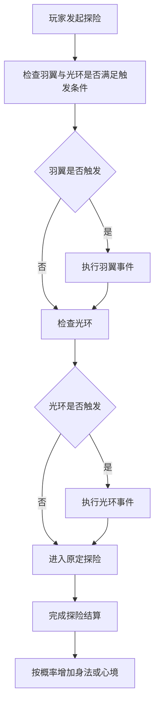

# 羽翼模块和光环模块设计方案

## 一、方案目标

本方案用于为现有修仙体系新增两个并行成长子系统：羽翼与光环。

两者都属于角色长期养成内容，但定位不同：

- 羽翼代表角色对身法、移动、御风与承载天地异象的掌控。
- 光环代表角色对心境、法则、气场与大道映照的掌控。

这两个系统都不直接替代等级、武器、装备、体质、异火、坐骑，而是作为探险链路中的高阶成长支线，承担以下职责：

1. 为探险玩法提供中长期追求目标。
2. 将血气与精神的一部分冗余资源，转化为新的成长资产。
3. 通过突破事件链强化世界地点与修炼叙事的绑定。
4. 通过失败、跌阶、冷却、属性损耗，维持高阶成长的风险感。
5. 为后续帮助页、人物面板、称号、日记、百科、历史等展示模块提供新的叙事素材。

## 二、系统定位

### 2.1 羽翼模块定位

羽翼模块是身法向养成系统。

玩家先通过血气消耗与探险补足身法，再在指定探险地点遭遇羽翼突破事件。突破采用事件选择加成功率判定的方式完成。羽翼十阶命名与事件文本已经明确，设计上应保证其具备以下特征：

- 有明确的前置成长门槛。
- 与普通探险流程强绑定，而不是独立副本。
- 不打断原探险结算，只在探险开始前插入事件链。
- 高阶失败应具备明显代价，形成风险递增。

### 2.2 光环模块定位

光环模块是心境向养成系统。

玩家先通过精神消耗与探险补足心境，再在指定探险地点遭遇光环突破事件。光环十阶同样采用事件选择加成功率判定的结构，但主题重心落在悟性、法则感知、气场化形、道意归源。

该系统与羽翼模块结构对称，便于玩家理解，也便于后续维护。

### 2.3 与现有系统的关系

羽翼和光环应视为与坐骑、异火、称号平级的独立二级玩法组件，但触发依赖探险，展示依赖玩家面板，数据沉淀依赖数据库公共层。

它们在链路上的关系建议如下：

- 玩家组件负责展示羽翼、光环、身法、心境等状态。
- 探险组件负责在探险开始前检查是否触发事件链。
- 回复层负责把突破事件、成功失败结果、冷却提示统一包装为标准回复。
- 日志/日记/历史类模块只反映结果，不主动参与玩法判定。

## 三、设计原则

### 3.1 对称但不混同

羽翼与光环在结构上尽量保持一致：

- 都有 10 阶。
- 都有基础属性蓄积阶段。
- 都有 20% 探险前触发概率。
- 都有放弃与尝试两个选择。
- 都有独立冷却。
- 都有失败惩罚与部分高阶跌阶。

但两者的资源来源、叙事意象、展示文案、失败代价倾向应有所区分：

- 羽翼更偏血气、生命、爆发与承压。
- 光环更偏精神、心念、法则与神识。

### 3.2 先养成后突破

事件链不是基础属性的唯一来源，而是成长验证节点。

玩家需要先积累身法或心境，再进入事件链检定。这样可以避免纯靠随机触发与纯靠运气进阶，也使成功率公式有明确意义。

### 3.3 风险前轻后重

低阶突破失败只造成轻度损耗与小额属性回退。

中高阶开始出现：

- 更高比例的生命或血气损耗
- 精神连带损耗
- 境界跌落
- 随机扣减 1 到 10 点属性
- 需要重新积累特定进度意象值的叙事提示

这样可以保证十阶成长具有压轴感。

### 3.4 不破坏探险主流程

事件链虽然插在探险前，但设计上不能把玩家长期卡死在交互流程里。

因此应遵循：

- 触发时先完成突破选择与判定。
- 选择结束后无论成败，都立即继续原定探险。
- 事件链属于探险前插入，不是额外创建一次新状态。

### 3.5 规则先于文本

你提供的命名和事件文本已经较完整，但落地时要先明确规则归一化，否则容易出现实现和文案相互冲突。

建议所有事件链统一抽象为：

- 触发条件
- 目标阶级
- 对应地点
- 放弃结果
- 尝试结果
- 成功判定公式
- 失败惩罚
- 冷却规则
- 是否跌阶

## 四、模块边界设计

### 4.1 建议的玩法边界

羽翼与光环应新建独立二级组件，各自负责本系统规则、展示、帮助文档和事件处理。

更稳妥的边界方案有两种：

#### 方案 A：两个独立组件

- 羽翼
- 光环

优点：

- 语义清晰
- 文案、帮助、命令、测试边界都独立
- 后续扩展不同效果时不互相污染

缺点：

- 公共逻辑会有一部分重复

#### 方案 B：一个共用成长组件，内部拆双分支

- 羽翼光环
  - wing 规则
  - halo 规则

优点：

- 公共规则集中
- 事件触发器、冷却、成功率工具函数可复用

缺点：

- 外部认知不如独立组件清晰
- 后续帮助文档与展示入口较容易耦合

从当前项目二级包按玩法拆分的风格来看，更推荐采用方案 A，并在公共层抽一套共享工具。

### 4.2 与探险组件的边界

探险组件不负责维护羽翼或光环的完整规则，只负责在探险开始前调用检查器。

探险侧只需要知道：

1. 当前地点是否可能触发羽翼事件。
2. 当前地点是否可能触发光环事件。
3. 是否满足触发前置条件。
4. 若双触发同时命中，先处理羽翼，再处理光环。
5. 两个事件结束后继续原探险流程。

羽翼和光环系统自身负责：

- 当前阶级判定
- 下一阶要求值判定
- 成功率计算
- 冷却是否生效
- 失败惩罚结算
- 展示文案拼装

### 4.3 与玩家组件的边界

玩家组件主要承担展示职责，不承担突破逻辑。

玩家面板建议新增展示：

- 身法值
- 羽翼阶级与名称
- 心境值
- 光环阶级与名称
- 当前对应冷却状态

如果版面有限，`修仙信息` 展示完整字段，`状态` 只展示精简信息。

### 4.4 与历史沉淀模块的边界

建议以下模块被动读取羽翼与光环结果：

- 修仙日记：记录首次激活、关键进阶、十阶大成。
- 修仙界历史：记录首位十阶羽翼、首位十阶光环、双十阶达成者。
- 称号系统：未来可增加与羽翼、光环相关的被动称号。
- 修仙百科/帮助：读取说明文档，展示阶级与事件设定。

## 五、核心成长规则设计

## 5.1 新增基础属性

新增两个长期属性：

- 身法，默认 0
- 心境，默认 0

这两个值都无上限。

### 5.2 身法成长规则

前 10 点身法通过血气转化获得：

- 每累计消耗 1000 血气，提升 1 点身法。
- 若当前血气不足 1000，则保留 1 点血气，其余可计入累计池。
- 当身法达到 10，或羽翼已突破 1 阶后，不再允许使用这种固定转化方式继续获取身法。

10 点之后的身法来源切换为探险被动成长：

- 当身法已达到 10 后，玩家完成探险时有 20% 概率获得 1 点身法。

这个设计的意义在于：

- 前期给所有玩家稳定入门路径。
- 后期把养成节奏锚定到探险活跃度。
- 避免玩家仅靠站桩消耗血气无限堆高。

### 5.3 心境成长规则

前 10 点心境通过精神转化获得：

- 每累计消耗 500 精神，提升 1 点心境。
- 若当前精神不足 500，则保留 1 点精神，其余可计入累计池。
- 当心境达到 10，或光环已突破 1 阶后，不再允许使用这种固定转化方式继续获取心境。

10 点之后的心境来源切换为探险被动成长：

- 当心境已达到 10 后，玩家完成探险时有 20% 概率获得 1 点心境。

### 5.4 一阶激活逻辑

原文只规定未激活 1 阶前不会触发突破事件链，但未明示 0 阶到 1 阶如何获得。

这是当前设计里最需要补齐的一块，否则系统会在入口层出现断点。

建议补成以下规则：

- 当玩家身法达到 10 时，可激活 1 阶羽翼 浮光初翎。
- 当玩家心境达到 10 时，可激活 1 阶光环 萤火织梦。
- 激活 1 阶不走随机事件链，采用确定性领悟式解锁。
- 解锁后才进入后续 1 阶升 2 阶到 9 阶升 10 阶的突破事件体系。

这样做的好处是：

- 与你给出的未激活 1 阶前不触发事件链完全兼容。
- 避免 0 阶到 1 阶也要再做一套额外事件文本。
- 给玩家一个清晰的新系统入门反馈。

## 六、阶级结构与命名落位

### 6.1 羽翼十阶结构

羽翼分四境十阶：

- 灵羽境
  - 1 阶 浮光初翎
  - 2 阶 乘风青羽
  - 3 阶 流云幻翼
- 仙羽境
  - 4 阶 星辉玉骨
  - 5 阶 琉璃净羽
  - 6 阶 九霄紫电
- 圣羽境
  - 7 阶 涅槃金焱
  - 8 阶 太虚月华
- 神羽境
  - 9 阶 混沌鸿蒙翅
  - 10 阶 创世星渊翼

### 6.2 光环十阶结构

光环分四境十阶：

- 微光境
  - 1 阶 萤火织梦
  - 2 阶 晨露凝光
  - 3 阶 月影伴行
- 玄光境
  - 4 阶 青莲剑歌
  - 5 阶 太极阴阳
  - 6 阶 八卦镇灵
- 道光境
  - 7 阶 大日如来
  - 8 阶 星河轮转
- 混沌光境
  - 9 阶 万法归宗
  - 10 阶 太初混元圈

### 6.3 命名层面的设计评价

这套命名整体上已经具备较强的层次感：

- 羽翼从风、云、星、雷、火、月、混沌、星渊逐步抬升。
- 光环从萤火、晨露、月影、剑气、阴阳、八卦、大日、星河、万法、太初逐步抬升。

设计方案中无需再重写命名，只需要确保：

- 面板展示时有阶级名和境界名双层信息。
- 帮助页里保留寓意说明，增强叙事识别。
- 失败、跌阶、提示文案中统一引用标准名称，避免别名混乱。

## 七、数值与成功率设计

### 7.1 下一阶要求值

羽翼与光环都采用线性门槛：

- 1 阶到 2 阶要求 20
- 2 阶到 3 阶要求 30
- 3 阶到 4 阶要求 40
- 4 阶到 5 阶要求 50
- 5 阶到 6 阶要求 60
- 6 阶到 7 阶要求 70
- 7 阶到 8 阶要求 80
- 8 阶到 9 阶要求 90
- 9 阶到 10 阶要求 100

这样与事件文本完全一致，也便于玩家记忆。

### 7.2 成功率公式

羽翼：

`成功率 = 当前身法 / 下一阶要求身法` 的平方

光环：

`成功率 = 当前心境 / 下一阶要求心境` 的平方

换成数学表达即：

- 羽翼：`P = 当前身法值 ÷ 目标要求值` 的平方
- 光环：`P = 当前心境值 ÷ 目标要求值` 的平方

建议落地规则再补一条边界说明：

- 当当前值大于要求值时，成功率按 100% 封顶。

否则在无上限属性模型下，公式会出现大于 100% 的结果。

### 7.3 公式特性分析

平方公式具有以下特点：

- 刚达到门槛时并非极高成功率，而是正好 100%。
- 如果未达门槛但被允许尝试，则成功率会明显偏低。
- 如果希望门槛成为硬前置，则不应允许属性低于需求时尝试。

这里需要补一个关键设计决定。

#### 推荐方案：要求值作为硬门槛

即：

- 未达到目标身法值，不触发羽翼突破事件。
- 未达到目标心境值，不触发光环突破事件。

原因：

1. 你提供的文本里每一阶都写了要求值，更像准入条件而非参考值。
2. 如果低于要求也能进，玩家会频繁用低概率试错，导致探险前事件链过度扰动。
3. 高风险惩罚在低属性下会过于苛刻，易造成挫败。

在这个推荐方案下，平方公式的实际意义会变成：

- 达标即 100% 成功
- 超额堆属性没有额外增益

这会让公式失去层次。

因此还需要二次修正。

#### 更优推荐：要求值是触发建议线，不是硬阻断线，但触发要加最低准入

建议采用三段式：

- 未达到基础准入值，不触发事件。
- 达到基础准入值但未到推荐值，可低概率尝试。
- 达到推荐值后成功率进入可接受区间，达到满推荐值时接近或达到 100%。

但你当前文档并未提供基础准入值，若现在要保持规则简单，最稳妥仍是：

- 只在达到要求值后触发事件。
- 将成功率公式保留为配置能力，后续若想做超额保底或动态修正，再扩展。

### 7.4 数值节奏判断

当前门槛从 20 到 100，按每次探险完成后 20% 概率获得 1 点属性估算，高阶积累会相当漫长。

这本身没有问题，因为羽翼与光环定位就是后期成长支线。但需要注意两个平衡点：

1. 高阶失败存在跌阶和随机扣点，意味着玩家可能会在 80 到 100 之间长期反复。
2. 如果没有额外保底或缓冲机制，顶级玩家可能因一次高阶失败而产生极强挫败。

因此建议在高层设计中预留两类可选缓冲，不一定首版上线：

- 失败保留部分隐性悟道进度
- 每日首次相关探险给予额外 1 次属性成长判定

首版如果追求纯粹，可以不做，但要意识到长线留存压力。

## 八、触发规则设计

### 8.1 总触发逻辑

在指定地点探险开始前，系统先检查是否需要触发羽翼/光环事件。

统一流程建议为：

1. 玩家发起探险。
2. 系统检查当前是否已满阶。
3. 检查当前是否处于对应事件冷却。
4. 检查当前阶级下一阶是否存在事件配置。
5. 检查地点是否匹配。
6. 检查属性值是否满足要求。
7. 通过 20% 概率判定是否触发。
8. 若羽翼和光环同时触发，先羽翼后光环。
9. 两个事件都处理完成后，继续原探险。

### 8.2 触发地点映射

你给出的规则应拆成两类地点：

#### 一类：逐阶专属地点

| 进阶段 | 羽翼地点 | 光环地点 |
|---|---|---|
| 1→2 | 天枢城 | 天枢城 |
| 2→3 | 青岚坊 | 青岚坊 |
| 3→4 | 赤霞港 | 赤霞港 |
| 4→5 | 玄铁岭 | 玄铁岭 |
| 5→6 | 万药谷 | 万药谷 |
| 6→7 | 云梦泽 | 云梦泽 |
| 7→8 | 流沙海市 | 流沙海市 |
| 8→9 | 寒霜关 | 寒霜关 |
| 9→10 | 雷泽城 | 雷泽城 |

这一类地点用于承接你文档后半段已经写明的逐阶突破事件链，是每个阶段最稳定、最直观的主触发场景。

#### 二类：通用触发地点

- 碧潮岛
- 星陨墟
- 太虚秘境

这一类地点保留前文通用触发描述，作为额外的公共感悟场景。

### 8.3 地点并存规则

按你的定稿，通用触发地点与逐阶专属地点并存，且三处通用地点与后续专属地点不重复，因此不构成地点冲突。

首版建议明确以下并存规则：

1. 逐阶专属地点仍然触发当前阶级对应的标准事件链。
2. 碧潮岛、星陨墟、太虚秘境也允许触发当前等阶的突破事件链。
3. 通用触发地点在单次探险开始前，只会触发羽翼或者光环其中一种，不会同时触发两种。
4. 若当前探险地点同时具备羽翼与光环的通用触发资格，则本次按纯随机方式二选一，随机决定只进入羽翼链或只进入光环链。
5. 若进入的是羽翼链，则本次不再追加光环链；若进入的是光环链，则本次不再追加羽翼链。

这样处理后，三处通用地点会形成“额外机会入口”，但不会让一次探险前连续弹出双事件，交互压力也更可控。

### 8.4 触发顺序

触发顺序建议分成两种场景解释：

#### 场景一：逐阶专属地点

当羽翼和光环同次探险均满足专属地点触发条件时：

- 先羽翼
- 再光环
- 最后进入探险预计算

这个顺序固定不变。

#### 场景二：通用触发地点

在碧潮岛、星陨墟、太虚秘境触发时：

- 本次只触发羽翼或光环其中一个系统
- 不会双触发
- 被选中的系统完成事件后，立即进入原定探险

这样既保留了“羽翼优先于光环”的主规则，也满足你新增的“通用地点单次只触发一种事件链”的修正要求。

### 8.5 满阶终止

达到 10 阶后：

- 不再触发对应事件链
- 仍可保留属性值继续累积
- 面板标记为已满阶

是否允许满阶后继续积累身法/心境，取决于后续是否预留超阶内容。根据当前文档的无上限设定，建议允许继续积累，但首版不赋予额外收益。

## 九、事件链结构设计

### 9.1 统一事件模板

每个突破事件都建议抽象成统一模板：

- 事件标题
- 当前阶级
- 目标阶级
- 要求属性
- 触发地点
- 系统提示文案
- 选项一 放弃感悟
- 选项二 尝试感悟
- 尝试后的成功文案
- 尝试后的失败文案
- 放弃冷却时长
- 失败是否冷却
- 失败是否跌阶
- 失败扣除项列表

这样后续即使想新增第 11 阶或特殊分支，也能复用同套结构。

### 9.2 放弃分支设计

你给出的规则是：

- 放弃突破时立即承受固定惩罚
- 放弃后进入 1 小时冷却
- 然后继续原探险

这是合理的，因为它能防止玩家在不愿承担风险时反复刷事件。

建议统一明确：

- 放弃不消耗身法或心境
- 放弃只造成资源损失与冷却
- 放弃不会跌阶

### 9.3 尝试分支设计

尝试后走成功率判定：

- 成功则进阶
- 失败则按该阶惩罚执行
- 然后继续原探险

建议补充统一约束：

- 尝试失败默认不进入 1 小时放弃冷却，除非事件配置显式要求
- 高阶失败的跌阶发生在本次惩罚结算完成后
- 若失败扣点后低于当前阶所需属性，不影响已持有阶级，只影响后续再突破

### 9.4 三段天雷的特殊事件

羽翼 5 阶升 6 阶的九霄引雷属于特殊三段判定事件。

高层设计建议如下：

- 仍然视为一次完整突破事件，不拆成三个独立冷却节点。
- 三道天雷每段都给反馈文本，但成功判定逻辑要先定一种统一方式。

建议方案：

#### 方案一：三次独立成功判定

- 每一道雷都按同一成功率判定一次。
- 三次全过才算成功。

优点：更有张力。

缺点：实际成功率会被大幅压低。

#### 方案二：一次总判定，三段仅做演出反馈

- 玩家选择尝试后只进行一次成功率判定。
- 文本表现为连续承受三道雷。
- 成功时三段都写成淬炼过程，失败时默认在第三道雷崩溃。

优点：实现与数值更稳。

缺点：交互戏剧性略弱。

从高层设计和数值可控性来看，更推荐方案二。

### 9.5 跌阶事件的分层

从你提供的文案来看，羽翼与光环都在中高阶开始出现跌阶，但跌回幅度并不完全一致。

建议保留原文设定，不额外统一成固定模式。因为不对称的跌阶深度，本身就是高阶事件特色的一部分。

但要统一一条规则：

- 跌阶后，玩家直接获得对应目标阶级的标准名称与显示状态。
- 跌阶不会倒扣已解锁图鉴或历史记录。

## 十、冷却设计

### 10.1 冷却定义

冷却期是指在倒计时结束前，不能再次触发当前对应突破事件。

### 10.2 冷却来源

按你当前文档，至少有明确的一类冷却：

- 放弃突破后，进入 1 小时冷却。

事件文案中多数放弃分支已明确写入 1 小时冷却。

### 10.3 失败后的冷却建议

原文未统一说明失败是否也进入冷却。

建议首版采用以下明确规则：

- 放弃：必进 1 小时冷却。
- 尝试失败：不追加统一冷却，完全按事件配置执行。

若你希望更严厉，也可以统一成失败同样进入冷却。但从玩家体验看，不建议首版这么做，因为：

- 失败本身已经伴随血气、精神、跌阶、扣点。
- 如果再统一锁 1 小时，会使高阶追赶过于迟滞。

### 10.4 冷却粒度

建议冷却按事件独立记录，而不是按整个系统记录。

例如：

- 羽翼 4 阶升 5 阶放弃后，锁的是琉璃净心事件。
- 不应影响光环事件。
- 若玩家因为跌阶回到更低阶，冷却仍只约束原事件，不追溯覆盖其他事件。

这样规则最清晰。

## 十一、失败惩罚与资源风险设计

### 11.1 惩罚类型归类

当前文本中的惩罚主要包含：

- 扣当前生命值百分比
- 扣当前血气值百分比
- 扣当前精神值百分比
- 扣 1 点身法或 1 点心境
- 随机扣 1 到 10 点身法或心境
- 境界跌落一阶或多阶
- 保留 1 点血气的清空式惩罚

这些惩罚已经足够形成层次，不建议再加新类型。

### 11.2 惩罚展示规范

为了避免玩家读不懂，建议所有失败反馈都统一展示三类信息：

1. 本次事件结果
2. 实际扣除内容
3. 当前剩余阶级与属性状态

例如失败后不只说扣了多少，还要告诉玩家：

- 当前羽翼退回第几阶
- 当前身法剩余多少
- 下次仍需去哪个地点尝试

### 11.3 极端扣除的保底规则

文案里有 100% 血气扣除并保留 1 点血气，以及 100% 生命值这类描述。

为了和现有系统稳定兼容，建议统一保底原则：

- 任何直接资源扣减，都至少保留 1 点可存活资源，除非现有系统已经允许该玩法直接死亡并有稳定回退逻辑。

尤其是光环 9 升 10 的失败文案写的是扣除 100% 生命值，但后文又写保留 1 点血气，这里存在字段混用。

推荐统一修正文案与规则：

- 全部用血气与精神作为可扣减主资源。
- 若文案写生命值，则在实际规则层映射为当前血气值。

否则玩家会分不清生命值与血气值的区别。

## 十二、展示设计

### 12.1 玩家面板展示

建议在 `修仙信息` 中加入完整展示：

```text
羽翼：6阶 · 九霄紫电
身法：68
羽翼突破：云梦泽可感悟

光环：5阶 · 太极阴阳
心境：57
光环突破：万药谷可感悟
```

若处于冷却中：

```text
羽翼突破冷却：剩余 43 分
光环突破冷却：无
```

### 12.2 专属面板展示

建议各自提供独立查询入口，例如：

- 羽翼
- 光环

用于展示：

- 当前阶级
- 当前名称
- 所属境界
- 当前属性值
- 下一阶要求
- 目标地点
- 当前冷却
- 对应意境说明

### 12.3 帮助页展示

帮助页建议包含：

- 十阶命名表
- 阶级境界说明
- 属性成长规则
- 成功率规则
- 触发地点表
- 冷却与失败惩罚规则
- 常见问题

## 十三、玩法流程图



## 十四、与现有系统的兼容性建议

### 14.1 与探险兼容

兼容重点在于探险开始前插入事件，不修改探险预计算主体，不新增第二套探险状态机。

### 14.2 与玩家状态兼容

需要确认以下状态下是否允许触发：

- 休息中
- 普通探险中
- 太虚秘境中
- 被抢劫目标状态
- 首领战或虫洞等待状态

推荐原则：

- 只有本次真正开始新探险时才判定突破事件。
- 已处于其他本体占用状态时，不允许触发。

### 14.3 与回复层兼容

突破事件属于典型的强交互消息，应使用标准按钮式选择，避免靠自由文本输入增加误操作概率。

### 14.4 与历史记录兼容

建议沉淀以下关键行为：

- 激活 1 阶羽翼
- 激活 1 阶光环
- 突破 5 阶、8 阶、10 阶
- 羽翼与光环同时达成某个关键里程碑

## 十五、平衡性评估

### 15.1 正向体验

这套系统的优势很明显：

- 命名美术感强，世界观一致。
- 与探险深度绑定，能提升探险长期价值。
- 资源转化路径明确，血气和精神不再只是战斗损耗品。
- 高阶事件具备仪式感。

### 15.2 潜在风险

需要重点关注以下风险：

#### 风险一：高阶养成周期过长

如果 10 点后的属性主要靠探险结束 20% 概率加 1，而高阶失败又会随机扣 1 到 10 点，最终可能出现玩家长期卡在 7 到 9 阶。

#### 风险二：双系统并行导致探险前事件过频

当玩家同时处于羽翼与光环可突破阶段时，如果 20% 和 20% 独立判定，部分高活跃玩家会明显感觉探险前打断频率升高。

可选缓解方式：

- 同次探险最多触发一个系统，另一个顺延
- 或维持现规则，但在 UI 上把双事件衔接做得更快

#### 风险三：惩罚字段不统一

生命值、血气值、精神值三种说法混用，必须在规则层统一成项目已有的正式字段语义。

#### 风险四：0 阶到 1 阶入口缺失

如果不补一阶激活逻辑，整套系统无法自然上线。

### 15.3 首版平衡建议

首版建议遵循以下平衡策略：

- 保留你现有的十阶事件文本主干不变。
- 补齐 0 阶到 1 阶解锁机制。
- 明确逐阶专属地点，放弃旧的通用地点描述。
- 统一资源字段为血气和精神。
- 高阶失败允许跌阶，但不叠加统一冷却。

这样既保留你设想中的高风险突破感，也能减少上线初期的规则歧义。

## 十六、推荐的最终规则定稿项

为便于后续进入实现阶段，建议先把以下几点定稿：

1. 0 阶到 1 阶是否采用确定性解锁。
2. 是否废弃前文中的碧潮岛、星陨墟、太虚秘境通用触发描述。
3. 成功率公式是否保留平方形式并在超过要求值时封顶 100%。
4. 属性要求值是否作为硬前置条件。
5. 羽翼 5 升 6 的三段天雷是一次总判定，还是三次独立判定。
6. 失败后是否默认没有统一冷却，只按事件配置执行。
7. 生命值字段是否统一解释为血气值。

## 十七、建议的开发切分顺序

虽然本方案不展开代码实现，但为了后续落地顺畅，建议按以下顺序推进：

1. 先定稿规则歧义项。
2. 再定玩家面板展示字段。
3. 再定探险前插入式事件链流程。
4. 再定数据库字段和冷却记录结构。
5. 最后补帮助页、图鉴式说明、历史沉淀与测试用例。

## 十八、结论

羽翼与光环是非常适合当前项目结构的两条长期成长支线。

它们最大的价值，不只是提供两组新面板，而是把探险、资源消耗、叙事文本、地点记忆和长期目标融合成一套更有修仙感的成长回路。

从你目前提供的资料看，命名、美术感、突破文本已经具备很强完成度；当前最需要补足的是规则收口与歧义消解，尤其是：

- 1 阶激活入口
- 触发地点冲突
- 成功率公式边界
- 高阶失败后的统一解释

只要把这几处定下来，这两个模块就可以形成一份稳定、清晰、可进入实现阶段的高层设计方案。