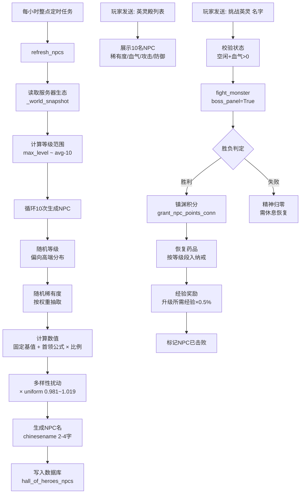

# 英灵殿模块设计方案

## 一、模块定位

英灵殿是英灵殿玩法的核心战斗模块。每小时自动刷新 10 名 NPC 精英怪，玩家可单人挑战，胜利后获得镇渊积分、固定恢复药品和经验奖励。NPC 数值采用"固定基值 + 首领公式 × 稀有度比例"混合生成，确保探险怪 < NPC < 首领 Boss。

---

## 二、命令

```text
英灵殿
英灵殿列表 / 英灵
挑战英灵 NPC名
英灵殿记录
```

---

## 三、NPC 刷新规则

- 每小时整点自动刷新 10 名 NPC，覆盖上一批未挑战的残留 NPC。
- 刷新时先清空上一批所有未挑战 NPC（无论是否已被挑战过），再生成新一批。
- 已被击败的 NPC 保留至下一批刷新前，供其他玩家查看战果但不重复挑战。
- NPC 刷新由定时任务驱动，不依赖玩家触发。

---

## 四、NPC 数值生成

### 4.1 等级范围

```python
max_player_level = max(row["level"] for row in all_players)
avg_player_level = snapshot["median_level"]  # 复用首领的 _world_snapshot()
low = max(1, avg_player_level - 10)
high = min(MAX_LEVEL, max_player_level)
```

等级范围：`[服务器玩家中位等级 - 10, 服务器玩家最高等级]`，下限最小为 1。

10 名 NPC 的等级分配偏向高端：

```python
for i in range(10):
    if random.random() < 0.7:
        level = random.randint((low + high) // 2, high)
    else:
        level = random.randint(low, high)
```

### 4.2 稀有度分配

8 级稀有度按权重随机分配：

| 稀有度 | 比例 | 权重 | 大致概率 |
|---|---|---|---|
| UR | 0.40 | 1 | ~1% |
| SSSR | 0.30 | 2 | ~2% |
| SSR | 0.22 | 5 | ~5% |
| SR | 0.16 | 10 | ~10% |
| S | 0.11 | 18 | ~18% |
| A | 0.07 | 24 | ~24% |
| B | 0.04 | 22 | ~22% |
| R | 0.02 | 18 | ~18% |

### 4.3 数值公式

```
NPC属性 = 固定基值(等级) + 首领公式(等级, 服务器生态) × 稀有度比例
最终属性 = floor(NPC属性 × uniform(0.981, 1.019))
```

#### 固定基值（只与等级挂钩）

| 属性 | 公式 | Lv1 | Lv50 | Lv100 |
|---|---|---|---|---|
| 血气 | `20 + level × 28` | 48 | 1420 | 2820 |
| 攻击 | `5 + level × 1.9` | 7 | 100 | 195 |
| 防御 | `3 + level × 1.1` | 4 | 58 | 113 |

#### 首领公式组件

```python
# 复用首领 _open_event() 的攻击/防御公式
boss_attack = median_hp / 22 + level * 1.5
boss_defense = median_attack * 0.42  # 取中值，NPC 不需要太大波动

# 血气组件：单人可打量级
boss_hp_component = median_hp / 18 + level * 12
```

#### 稀有度比例

| 稀有度 | 比例 | 与首领关系 | 与同级探险怪关系 |
|---|---|---|---|
| UR | 0.40 | 约首领攻击/防御的 40% | 约 3.5~4.5 倍 |
| SSSR | 0.30 | 约首领的 30% | 约 3.0~3.8 倍 |
| SSR | 0.22 | 约首领的 22% | 约 2.5~3.2 倍 |
| SR | 0.16 | 约首领的 16% | 约 2.2~2.8 倍 |
| S | 0.11 | 约首领的 11% | 约 1.9~2.4 倍 |
| A | 0.07 | 约首领的 7% | 约 1.6~2.0 倍 |
| B | 0.04 | 约首领的 4% | 约 1.3~1.6 倍 |
| R | 0.02 | 约首领的 2% | 约 1.0~1.2 倍 |

#### 多样性扰动

最终三项数值额外乘以 `uniform(0.981, 1.019)`，使同等级同稀有度的 NPC 数值有细微差异。

```python
hp = max(1, floor(raw_hp * random.uniform(0.981, 1.019)))
attack = max(1, floor(raw_attack * random.uniform(0.981, 1.019)))
defense = max(1, floor(raw_defense * random.uniform(0.981, 1.019)))
```

### 4.4 NPC 命名

使用 `chinesename` 库随机生成 2~4 字中文名：

```python
from chinesename import ChineseName

cn = ChineseName()
name = cn.generate()  # 生成随机中文名
# 确保长度在 2~4 字
while not (2 <= len(name) <= 4):
    name = cn.generate()
```

> 需在 `requirements.txt` 中添加 `chinesename` 依赖。

### 4.5 NPC 战斗类型

NPC 的 `kind`（族群）按稀有度映射，影响战斗技能风格：

| 稀有度 | 族群 | 战斗风格 |
|---|---|---|
| UR | 古卫 | 慢速重击，高穿透 |
| SSSR | 魔 | 法器镇压，扰乱行动 |
| SSR | 龙 | 多段游斗，穿透 |
| SR | 鬼 | 压精神，灼烧 |
| S | 妖 | 快速连击，命中稳定 |
| A | 兵 | 攻守兼备 |
| B | 兽 | 重击破甲 |
| R | 傀 | 均衡 |

---

## 五、挑战规则

- 玩家必须空闲且血气 > 0 才能挑战。
- 每名 NPC 每个玩家只能挑战 1 次。
- NPC 被击败后从列表移除（或标记为已击败），其他玩家不可再挑战同一 NPC。
- 挑战使用 [`combat_core.fight_monster()`](../combat_core.py:23)，行动上限 80 次。
- NPC 传入 `boss_panel=True`，获得 Boss 级技能和速度。
- 战败后玩家精神归零，需要休息恢复。
- 挑战不占用探险时间，不影响探险状态。
- 探险中不能挑战英灵殿 NPC。

---

## 六、奖励

### 6.1 镇渊积分

胜利后获得 NPC 镇渊积分，积分数量与 NPC 稀有度挂钩：

| 稀有度 | 镇渊积分 |
|---|---|
| UR | 50 |
| SSSR | 30 |
| SSR | 20 |
| SR | 12 |
| S | 8 |
| A | 5 |
| B | 3 |
| R | 1 |

通过 [`zhenyuan_zhuxie_service.grant_npc_points_conn()`](../镇渊诛邪/service.py:614) 写入，`point_ratio=10.0`。

### 6.2 固定恢复药品

胜利后获得 NPC 等级对应的固定恢复药品，直接进入纳戒：

| NPC 等级段 | 血气恢复药品 | 精神恢复药品 |
|---|---|---|
| 1~20 | 血契丹（恢复 25% 血气） | 阴冥草（恢复 25% 精神） |
| 21~50 | 回春露（恢复 45% 血气） | 凝神露（恢复 45% 精神） |
| 51~80 | 生骨丹（恢复 70% 血气） | 养魂丹（恢复 70% 精神） |
| 81~100 | 生骨丹（恢复 70% 血气）x2 | 养魂丹（恢复 70% 精神）x2 |

药品 ID 对应 [`sql.py`](../sql.py) 中的 `ring_item_defs`：

```python
NPC_RECOVER_ITEMS = {
    (1, 20):  ("xueqidan", "yinmingcao"),
    (21, 50): ("huichunlu", "ningshenlu"),
    (51, 80): ("shenggudan", "yanghundan"),
    (81, 100): ("shenggudan", "yanghundan"),  # 数量 x2
}
```

### 6.3 经验奖励

胜利后获得玩家当前升级所需经验的 0.5%：

```python
exp_reward = max(1, int(player_next_level_exp * 0.005))
```

`player_next_level_exp` 来自 [`rules.py`](../rules.py) 的升级经验公式。

---

## 七、数据库表

### 7.1 `hall_of_heroes_npcs`（当前批次 NPC）

```sql
CREATE TABLE IF NOT EXISTS hall_of_heroes_npcs (
    npc_id INTEGER PRIMARY KEY AUTOINCREMENT,
    name TEXT NOT NULL,
    tier TEXT NOT NULL,          -- UR/SSSR/SSR/SR/S/A/B/R
    level INTEGER NOT NULL,
    hp INTEGER NOT NULL,
    max_hp INTEGER NOT NULL,
    attack INTEGER NOT NULL,
    defense INTEGER NOT NULL,
    kind TEXT NOT NULL DEFAULT '傀',
    defeated INTEGER NOT NULL DEFAULT 0,
    batch_id TEXT NOT NULL,      -- 批次标识，格式 '2026062716'
    generated_at TEXT NOT NULL,
    defeated_at TEXT
);
```

### 7.2 `hall_of_heroes_challenges`（挑战记录）

```sql
CREATE TABLE IF NOT EXISTS hall_of_heroes_challenges (
    challenge_id INTEGER PRIMARY KEY AUTOINCREMENT,
    npc_id INTEGER NOT NULL,
    client_id TEXT NOT NULL,
    win INTEGER NOT NULL DEFAULT 0,
    damage_dealt INTEGER NOT NULL DEFAULT 0,
    hp_left INTEGER NOT NULL DEFAULT 0,
    mp_left INTEGER NOT NULL DEFAULT 0,
    zhenyuan_points INTEGER NOT NULL DEFAULT 0,
    exp_gained INTEGER NOT NULL DEFAULT 0,
    recover_item_id TEXT NOT NULL DEFAULT '',
    recover_quantity INTEGER NOT NULL DEFAULT 0,
    actions TEXT DEFAULT '',     -- JSON 战斗日志
    challenged_at TEXT NOT NULL,
    FOREIGN KEY (npc_id) REFERENCES hall_of_heroes_npcs(npc_id),
    FOREIGN KEY (client_id) REFERENCES players(client_id),
    UNIQUE(npc_id, client_id)   -- 每人每 NPC 只能挑战 1 次
);
```

### 7.3 `hall_of_heroes_batches`（批次记录）

```sql
CREATE TABLE IF NOT EXISTS hall_of_heroes_batches (
    batch_id TEXT PRIMARY KEY,  -- 格式 '2026062716'
    generated_at TEXT NOT NULL,
    npc_count INTEGER NOT NULL DEFAULT 10
);
```

---

## 八、目录结构

```text
修仙/英灵殿/
  __init__.py      WS 命令注册 + 定时刷新任务
  service.py       英灵殿业务逻辑
  说明.md          本组件说明
```

---

## 九、命令注册

```python
# __init__.py

@WsMessageHandler.handler(cmd="英灵殿", priority=100, block=True)
async def ws_hall_of_heroes(client_id: str, message: str):
    await send_reply(client_id, service.overview(client_id), ws_manager, service)

@WsMessageHandler.handler(cmd=("英灵殿列表", "英灵"), priority=100, block=True)
async def ws_hall_npc_list(client_id: str, message: str):
    await send_reply(client_id, service.npc_list(client_id), ws_manager, service)

@WsMessageHandler.handler(cmd="挑战英灵", priority=100, block=True)
async def ws_challenge_npc(client_id: str, message: str):
    await send_reply(client_id, service.challenge(client_id, message), ws_manager, service)

@WsMessageHandler.handler(cmd="英灵殿记录", priority=100, block=True)
async def ws_hall_records(client_id: str, message: str):
    await send_reply(client_id, service.records(client_id), ws_manager, service)
```

---

## 十、定时刷新

```python
# __init__.py 中注册定时任务

from apscheduler.schedulers.asyncio import AsyncIOScheduler

scheduler = AsyncIOScheduler()

@scheduler.scheduled_job("cron", minute=0)  # 每小时整点
async def refresh_npcs():
    service.refresh_npcs()
```

---

## 十一、核心流程



---

## 十二、组件关联

- **上游读取**：[`combat_core.py`](../combat_core.py) 的 `fight_monster()` 战斗结算；[`镇渊诛邪/service.py`](../镇渊诛邪/service.py) 的 `grant_npc_points_conn()` 积分写入；[`rules.py`](../rules.py) 的升级经验公式；[`common.py`](../common.py) 的 `CoreService` 基类和纳戒操作。
- **下游写入**：`hall_of_heroes_npcs` NPC 表、`hall_of_heroes_challenges` 挑战记录表、`hall_of_heroes_batches` 批次表、`ring_items` 纳戒恢复药品、`player_zhenyuan_points` 镇渊积分。
- **互斥**：探险中不能挑战英灵殿 NPC；挑战英灵殿 NPC 时不影响探险状态。

---

## 十三、扩展入口

| 调整目标 | 改什么 |
|---|---|
| NPC 数量 | 改 `HALL_NPC_COUNT` 常量 |
| 刷新频率 | 改定时任务 cron 表达式 |
| 稀有度分布 | 改 `NPC_TIER_WEIGHTS` 权重 |
| NPC 整体强度 | 改固定基值公式中的乘数 |
| UR 更接近 boss | 提高 `NPC_TIER_RATIOS["UR"]` |
| 恢复药品档位 | 改 `NPC_RECOVER_ITEMS` 等级段映射 |
| 经验比例 | 改 `HALL_EXP_RATIO`（当前 0.005） |
| 镇渊积分 | 改 `NPC_TIER_POINTS` 各档积分 |
| NPC 命名风格 | 替换 `chinesename` 库或加前后缀 |

---

## 十四、首版实现边界

- 已实现：NPC 刷新、数值生成、挑战战斗、镇渊积分、恢复药品、经验奖励、列表展示、挑战记录。
- 当前不做：NPC 之间的联动、NPC 成长、NPC 装备、多人协作挑战、NPC 排行榜。
- 当前不做：英灵殿网页战斗日志（复用现有 `战斗日志/site.py`）。
