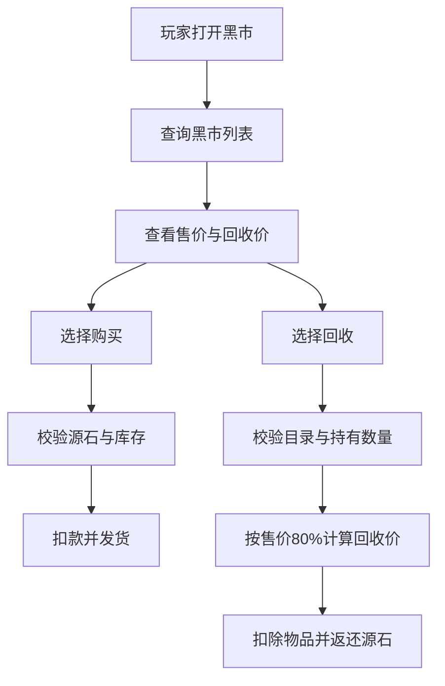

# 黑市模块设计方案

## 一、目标与边界

黑市是一个**系统统一售卖与统一回收**的模块，定位为修仙体系里的特殊 NPC 商店：

- 玩家**可以查询黑市物品列表**。
- 玩家**可以直接购买黑市物品**。
- 玩家**不能在黑市上架任何物品**。
- 玩家**只能回收黑市目录内已有的物品**。
- 黑市回收价固定为**售价的 80%**，并向下取整到整数源石。

黑市与二手市场的边界：

- 二手市场是**玩家对玩家交易**，黑市是**系统对玩家交易**。
- 黑市不保留卖家、不产生手续费分成、不需要玩家上架流程。
- 黑市回收不是普通出售分流，不应混入 `出售`、`自动出售`、`出售全部` 的现有规则里。

## 二、核心玩法定义

### 1. 黑市售卖

系统维护一份黑市商品目录，目录内每个商品固定包含：

- 物品类型
- 物品标识
- 展示名称
- 售价
- 是否允许购买
- 是否允许回收
- 排序权重或分类

玩家查询黑市时，只看到系统预置商品，不看到玩家持有信息，也不看到其他玩家交易信息。

### 2. 黑市回收

黑市回收只允许处理**黑市目录里存在的物品**，即：

- 黑市在目录中有该物品，玩家才可以回收。
- 目录外物品一律拒绝回收。
- 回收单价 = 售价 × 80%
- 回收总价 = 回收单价 × 数量
- 金额处理建议向下取整，避免浮点误差

回收时，系统从玩家背包、纳戒、宝石库、武器持有关系等对应库存中扣除物品，再返还源石。

### 3. 不做的事情

黑市不做以下能力：

- 不支持玩家上架
- 不支持玩家之间转卖
- 不支持竞价
- 不支持匿名寄售
- 不作为二手市场的替代品
- 不参与跑商利润曲线
- 不影响世界物资、战备蓄能、藏宝图生成逻辑

## 三、建议命令设计

建议黑市独立成组件，入口风格与现有模块保持一致。

| 命令 | 作用 |
|---|---|
| 黑市 | 查看黑市简介与快捷入口 |
| 黑市列表 | 查看黑市商品列表 |
| 黑市购买 物品名 数量 | 购买指定物品 |
| 黑市购买 物品编号 数量 | 按编号购买，适合列表操作 |
| 黑市回收 物品名 数量 | 回收黑市目录内物品 |
| 黑市回收 物品编号 数量 | 按编号回收，适合列表操作 |

建议交互策略：

- `黑市` 只展示总览与说明，不铺满复杂按钮。
- `黑市列表` 展示分类、售价、回收价、是否可买、是否可回收。
- `黑市购买` 和 `黑市回收` 都支持名称与编号两种定位方式。
- 若玩家输入的物品不在黑市目录内，直接返回统一提示，不走任何资产变更。

## 四、推荐数据模型

### 1. 黑市目录表

表名建议：`black_market_defs`

| 字段 | 类型 | 说明 |
|---|---|---|
| market_item_id | TEXT PRIMARY KEY | 黑市商品稳定 ID |
| item_type | TEXT NOT NULL | backpack、ring、gem、weapon 等 |
| item_id | TEXT NOT NULL | 对应系统物品 ID |
| display_name | TEXT NOT NULL | 展示名称 |
| sale_price | INTEGER NOT NULL | 售价 |
| recycle_rate | REAL NOT NULL DEFAULT 0.8 | 回收比例，默认 0.8 |
| can_buy | INTEGER NOT NULL DEFAULT 1 | 是否允许购买 |
| can_recycle | INTEGER NOT NULL DEFAULT 1 | 是否允许回收 |
| sort_order | INTEGER NOT NULL DEFAULT 0 | 列表排序 |
| category | TEXT NOT NULL DEFAULT '' | 分类标签 |
| note | TEXT NOT NULL DEFAULT '' | 额外说明 |
| created_at | TEXT NOT NULL | 创建时间 |
| updated_at | TEXT NOT NULL | 更新时间 |

设计要点：

- 黑市采用**固定目录**，不引入玩家库存上架表。
- `sale_price` 是黑市面向玩家的统一售价。
- `recycle_rate` 允许未来个别商品有特殊回收折扣，但默认固定 0.8。
- `can_buy` 和 `can_recycle` 可以支持极少数只卖不收、只收不卖的特殊商品。

### 2. 黑市交易记录表

表名建议：`black_market_records`

| 字段 | 类型 | 说明 |
|---|---|---|
| record_id | INTEGER PRIMARY KEY AUTOINCREMENT | 记录 ID |
| client_id | TEXT NOT NULL | 玩家 ID |
| action_type | TEXT NOT NULL | buy 或 recycle |
| market_item_id | TEXT NOT NULL | 黑市商品 ID |
| item_type | TEXT NOT NULL | 物品类型 |
| item_id | TEXT NOT NULL | 物品 ID |
| quantity | INTEGER NOT NULL | 数量 |
| unit_price | INTEGER NOT NULL | 单价 |
| total_price | INTEGER NOT NULL | 总价 |
| created_at | TEXT NOT NULL | 创建时间 |

用途：

- 统计黑市活跃度
- 后续接称号、日记、运营日志
- 为审计和异常排查提供依据

### 3. 与现有物品系统的关系

黑市目录建议直接复用现有定义体系：

- 背包物品来自 `item_defs`
- 纳戒物品来自 `ring_item_defs`
- 宝石来自现有宝石定义体系
- 武器来自 `weapon_defs` 或现有武器实例规则

黑市只负责“系统目录与交易规则”，不负责新增物品定义本身。

## 五、业务流程设计

### 1. 查询列表

流程：

1. 校验玩家已建档。
2. 读取黑市目录。
3. 按分类、排序权重、名称排序展示。
4. 在展示中同时给出售价与回收价。

展示建议示例：

- 黑市物品名｜售价 10000｜回收 8000｜库存策略：固定目录
- 黑市物品名｜售价 5000｜回收 4000｜可买｜可回收

### 2. 购买流程

流程：

1. 校验玩家已建档。
2. 定位黑市目录项。
3. 校验该商品允许购买。
4. 校验玩家随身源石是否足够。
5. 扣除源石。
6. 将物品发放到玩家对应库存。
7. 记录黑市购买日志。

库存发放规则建议沿用现有物品处理方式：

- 背包物品检查格子、负重、堆叠
- 纳戒物品写入纳戒库存
- 宝石写入宝石库存
- 武器按现有武器实例逻辑发放，必要时自动装备或作为备用武器

### 3. 回收流程

流程：

1. 校验玩家已建档。
2. 定位黑市目录项。
3. 校验该商品允许回收。
4. 校验玩家持有数量是否足够。
5. 按 `售价 × 80% × 数量` 计算回收金额。
6. 扣除玩家库存中的对应物品。
7. 发放源石。
8. 记录黑市回收日志。

回收时的关键约束：

- 只允许目录内物品回收
- 不允许以“类似物品”替代
- 不允许目录外物品绕过规则进入黑市回收
- 若库存不足，整个回收失败，不做部分成功

## 六、与现有模块的联动规则

### 1. 与二手市场的关系

黑市与二手市场职责分离：

- 二手市场：玩家卖给玩家，存在卖家、托管、手续费、成交记录
- 黑市：系统卖给玩家，系统回收玩家物品，不存在卖家和手续费分成

建议规则：

- 黑市不复用二手市场的上架流程
- 黑市不使用二手市场的卖家定位逻辑
- 黑市交易记录单独落库，不写入二手市场成交记录
- 黑市不触发二手市场成交到账通知

### 2. 与贸易服务的关系

贸易服务负责跑商、出售分流和导航；黑市建议作为独立入口，不混入 `出售` 和 `自动出售` 的分流链路。

建议规则：

- `出售` 继续负责普通出售、特殊收购与系统回收
- 黑市回收不进入贸易服务的自动出售逻辑
- 黑市购买不参与跑商地点、商品价格波动和收益曲线
- 如果后续需要，可以在贸易服务总入口增加“黑市入口按钮”，但业务仍由黑市组件独立处理

### 3. 与商城的关系

如果系统里已有“商城”或“商场行情”概念，黑市应保持独立定位：

- 商城偏公开、稳定、常规供给
- 黑市偏特殊、稀有、系统控制供给

建议：

- 同一物品若同时存在商城与黑市，二者价格与回收规则应独立配置
- 黑市的回收价不反向影响商城定价
- 黑市不参与商场热度、跑商利润和地点供需

## 七、关键边界与异常处理

### 1. 购买失败边界

- 玩家源石不足
- 目录项不可购买
- 背包空间不足
- 物品类型发放失败
- 武器发放时违反现有武器持有规则

### 2. 回收失败边界

- 物品不在黑市目录
- 目录项不可回收
- 玩家库存不足
- 武器已被装备或不满足现有回收限制
- 宝石、纳戒、背包物品数量不足

### 3. 金额规则

建议统一采用整数源石：

- 购买价格按黑市售价直接扣除
- 回收价格按 `floor(售价 × 0.8)` 结算
- 若未来某些商品存在特殊折扣，可仅在目录表里覆盖 `recycle_rate`

## 八、推荐实现拆分

建议黑市独立成组件目录：

- `修仙/黑市/__init__.py`：挂载 WS 命令
- `修仙/黑市/service.py`：黑市业务处理
- `修仙/黑市/说明.md`：组件说明

实现时优先复用：

- `CoreService` 的建档与库存操作能力
- 背包、纳戒、宝石、武器的现有增删逻辑
- 源石扣除与到账能力
- 文本面板输出工具

## 九、推荐交互示意

## 十、落地建议

建议黑市第一版按以下原则落地：

1. 先实现固定目录
2. 先实现购买与回收两个主流程
3. 回收比例固定 80%
4. 不引入玩家上架
5. 不与二手市场抢职责
6. 不与贸易服务的出售分流混用

这样可以保持黑市是一个**稳定、可控、可审计的系统交易口**，同时不破坏现有二手市场、贸易服务和普通出售体系的边界。
